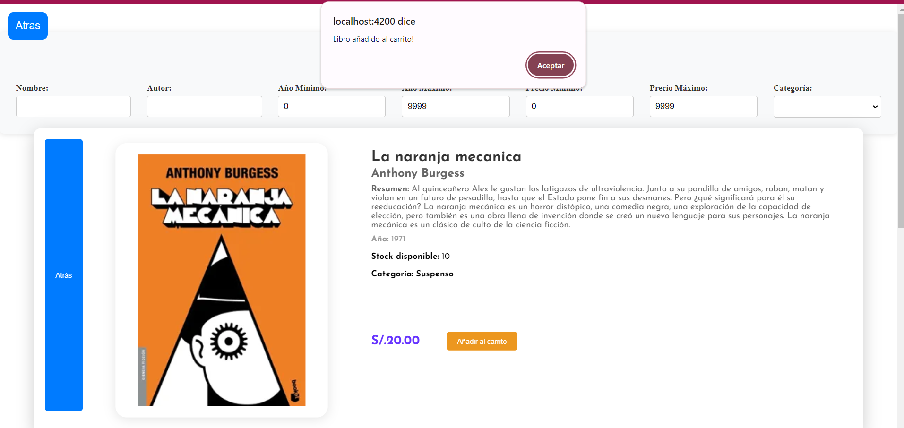
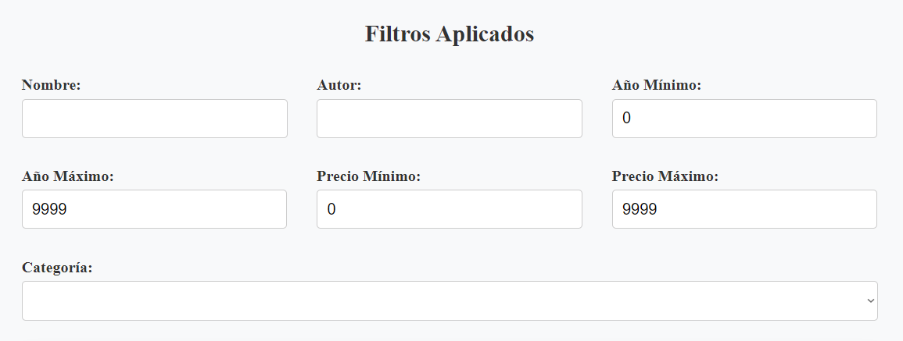
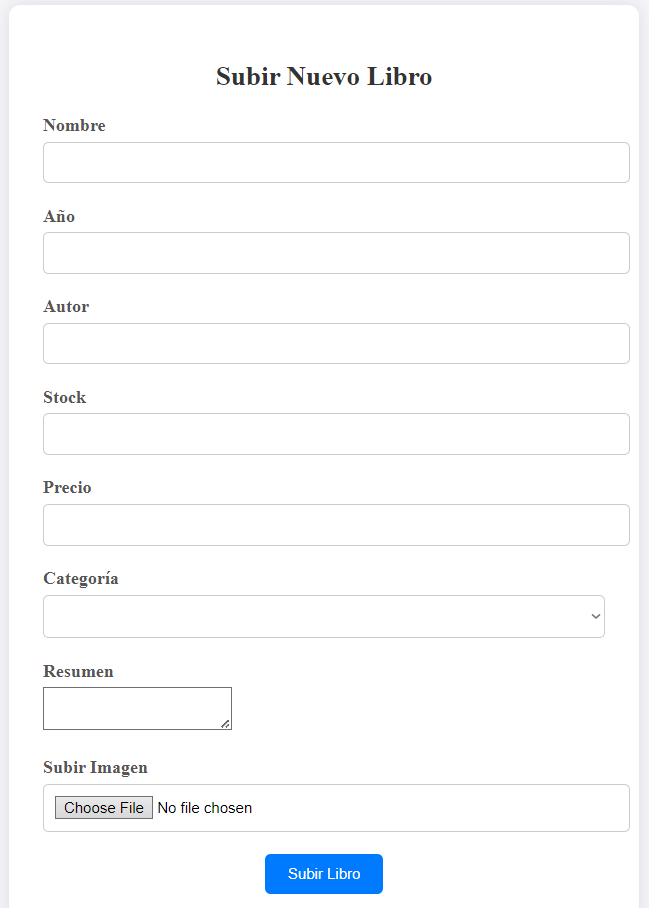

# 

**Año del Bicentenario, de la consolidación de nuestra Independencia, y de la conmemoración de las heroicas batallas de Junín y Ayacucho**

### FACULTAD DE INGENIERÍA DE PRODUCCIÓN Y SERVICIOS ESCUELA PROFESIONAL DE INGENIERÍA DE SISTEMAS

---

**ASIGNATURA:**  
Programación Web 2

**TEMA:**  
Informe del proyecto final

**DOCENTE:**  
Ing. Carlos Corrales

**INTEGRANTES:**  
- Ramirez Ccahuana Max Edú
- Quispe Madariaga Jeferson Jofre
- Huamani Ollachica, David Alfredo

---

**AREQUIPA - PERÚ**  
2024

---
---

## 1. Descripción del proyecto final

El proyecto consiste en el desarrollo de una aplicación web para una librería en línea. Esta aplicación permite a los usuarios registrarse, comprar libros y gestionar un carrito de compras. Además, se genera una factura al finalizar la compra. La aplicación está desarrollada usando **Django** para el backend y **Angular** para el frontend, con comunicación entre ambos mediante una **API**.

### Propósito del Proyecto

Este proyecto tiene como objetivo principal crear una plataforma dinámica e interactiva que permita a los autores de libros vender tanto sus libros físicos como digitales directamente a los lectores. Al proporcionar un espacio centralizado y accesible, buscamos facilitar el intercambio cultural y la promoción de nuevas obras literarias, ofreciendo a los usuarios una experiencia de compra enriquecida y cómoda.

### Beneficios para los Autores:

- **Visibilidad y Alcance:** Los autores pueden alcanzar una audiencia global sin necesidad de intermediarios, maximizando la visibilidad de sus obras.
- **Control y Flexibilidad:** Los autores tienen control total sobre sus precios, descripciones y categorías de libros, lo que les permite adaptar su estrategia de venta según sus necesidades.
- **Comisión Competitiva:** Al reducir los intermediarios, los autores pueden beneficiarse de una mayor proporción de las ventas.

### Beneficios para los Usuarios:

- **Variedad y Accesibilidad:** Los usuarios pueden explorar una amplia gama de libros de diversos géneros y categorías, tanto en formato físico como digital.
- **Experiencia de Compra Fácil:** La plataforma ofrece un proceso de compra intuitivo y seguro, con funciones como el carrito de compra y la generación de facturas.

---

## 2. Herramientas utilizadas

- **Backend:** Django
- **Frontend:** Angular
- **Base de datos:** SQLite (para desarrollo)
- **Estilos:** Bootstrap y CSS personalizado
- **Otras tecnologías:** AJAX para operaciones asíncronas, Django REST framework para la creación de APIs, y servicios de correo electrónico integrados.

---

## 3. Funciones del proyecto

- **Registro y autenticación de usuarios:** Los usuarios pueden registrarse, iniciar sesión y cerrar sesión.
- **Gestión de libros:** Listado de libros, detalles de cada libro, creación, actualización y eliminación de libros en un carrito de compras.
- **Carrito de compras:** Los usuarios pueden añadir libros al carrito, ver el carrito, y proceder con la compra.
- **Generación de facturas:** Se genera una factura al completar una compra.
- **Consultas JSON:** Las vistas permiten obtener datos en formato JSON para su uso en el frontend.

---
## 4. Django

### models.py

| Modelo            | Descripción                                                                                                                                                                                                                                      | Campos                                                                                                                                                                                                                                                                                                                                 |
|-------------------|--------------------------------------------------------------------------------------------------------------------------------------------------------------------------------------------------------------------------------------------------|---------------------------------------------------------------------------------------------------------------------------------------------------------------------------------------------------------------------------------------------------------------------------------------------------------------------------------------|
| **User**          | Este modelo extiende el modelo AbstractUser de Django, añadiendo algunos campos adicionales.                                                                                                                                                      | - **address:** CharField (longitud máxima de 100 caracteres) - **number:** IntegerField - **portrait:** ImageField (almacena imágenes en una carpeta específica)                                                                                                                                                                |
| **ShoppingCart**  | Este modelo representa un carrito de compras asociado a un usuario.                                                                                                                                                                               | - **idUser:** ForeignKey (relación con el modelo User) - **idBooks:** ManyToManyField (relación con el modelo Book) - **date:** DateField (fecha de la última modificación del carrito)                                                                                                                                        |
| **Book**          | Este modelo representa un libro en la biblioteca.                                                                                                                                                                                                 | - **name:** CharField - **year:** IntegerField - **author:** CharField - **summary:** TextField - **portrait:** ImageField - **stock:** IntegerField - **price:** DecimalField - **category:** CharField (opciones: Suspenso, Romance, Ciencia Ficción, Aventura, Fantasía, Acción, N/A)                           |
| **CartBook**      | Este modelo crea una relación muchos-a-muchos entre ShoppingCart y Book.                                                                                                                                                                          | - **idCart:** ForeignKey (relación con ShoppingCart) - **idBook:** ForeignKey (relación con Book)                                                                                                                                                                                                                                 |
| **Sale**          | Este modelo representa una venta realizada.                                                                                                                                                                                                       | - **payMethod:** CharField (opciones: Credit card, Debit card, Cash) - **idUser:** ForeignKey (relación con User) - **idBook:** ForeignKey (relación con Book) - **date:** DateField                                                                                                                                        |
| **Funciones**     | **clean:** Valida y limpia los datos antes de guardarlos en la base de datos.  **save:** Sobrescribe para llamar a clean antes de guardar el objeto en la base de datos. Garantiza que los datos sean válidos y limpios antes de su almacenamiento. | - **clean:** Verifica que el total de la venta no sea negativo (en el modelo Sale) - **save:** Asegura que se llame a clean antes de guardar el objeto en la base de datos                                                                                                                                                         |

---
## 5. views.py

### [UserViewSet](#userviewset)
- **Función:** Proporciona las operaciones CRUD para el modelo User.
- **Serializer:** UserSerializer
- **Permisos:** No específicos (por defecto, permite todas las operaciones).

### [RegisterView](#registerview)
- **Función:** Permite registrar nuevos usuarios.
- **Serializer:** UserSerializer
- **Permisos:** AllowAny (permite acceso a cualquier usuario, incluso no autenticado).

### [LoginView](#loginview)
- **Función:** Maneja el inicio de sesión de los usuarios.
- **Serializer:** LoginSerializer
- **Permisos:** AllowAny
- **Método post:** Valida las credenciales del usuario y, si son correctas, inicia la sesión.

### [LogoutView](#logoutview)
- **Función:** Maneja el cierre de sesión de los usuarios.
- **Método post:** Cierra la sesión del usuario actual.

### [BookViewSet](#bookviewset)
- **Función:** Proporciona las operaciones CRUD para el modelo Book.
- **Serializer:** BookSerializer

### [SaleViewSet](#saleviewset)
- **Función:** Proporciona las operaciones CRUD para el modelo Sale.
- **Serializer:** SaleSerializer
- **Método get_queryset:** Filtra las ventas por el idUser si se proporciona.

### [UserBooksView](#userbooksview)
- **Función:** Devuelve una lista de libros comprados por un usuario específico.
- **Serializer:** BookSerializer
- **Método get_queryset:** Filtra los libros por el idUser proporcionado en los parámetros de consulta.

### [CreateBookView](#createbookview)
- **Función:** Crea un nuevo libro.
- **Serializer:** BookSerializer
- **Método post:** Crea un libro nuevo con los datos proporcionados.

### [EmailViewSet](#emailviewset)
- **Función:** Envía correos electrónicos a una lista de clientes seleccionados.
- **Método post:** Lee los datos del cuerpo de la solicitud (JSON) y envía correos electrónicos a los clientes especificados.

### [UserIdView](#useridview)
- **Función:** Devuelve el ID de usuario basado en el correo electrónico proporcionado.
- **Método get:** Busca un usuario por correo electrónico y devuelve su ID.

### [DeleteMessageView](#deletemessageview)
- **Función:** Elimina un mensaje específico.
- **Método delete:** Elimina el mensaje identificado por message_id.

### [SendMessageView](#sendmessageview)
- **Función:** Envía un mensaje.
- **Método post:** Envía un mensaje desde un usuario específico.

### [ShowMessagesView](#showmessagesview)
- **Función:** Muestra todos los mensajes.
- **Método get:** Devuelve una lista de todos los mensajes.

### [UserBooksAPIView](#userbooksapiview)
- **Función:** Devuelve una lista de libros comprados por un usuario con la fecha de compra.
- **Serializer:** BookWithSaleDateSerializer
- **Método get:** Filtra los libros por el idUser proporcionado.

### [AddBookToUserAPIView](#addbooktouserapiview)
- **Función:** Añade un libro a un usuario específico.
- **Método post:** Añade un libro al usuario identificado por idUser.

### [DecrementBookStockAPIView](#decrementbookstockapiview)
- **Función:** Disminuye el stock de un libro.
- **Método post:** Disminuye el stock del libro identificado por bookId.

### [IncrementBookStockAPIView](#incrementbookstockapiview)
- **Función:** Aumenta el stock de un libro.
- **Método post:** Aumenta el stock del libro identificado por bookId.

### [ShoppingCartViewSet](#shoppingcartviewset)
- **Función:** Proporciona operaciones para el carrito de compras.
- **Método retrieve:** Devuelve los libros en el carrito del usuario identificado por pk.
- **Método create:** Crea un carrito de compras para un usuario.
- **Método add_book:** Añade un libro al carrito del usuario identificado por pk.
- **Método remove_book:** Elimina un libro del carrito del usuario identificado por pk.

### [generate_pdf](#generate_pdf)
- **Función:** Genera un archivo PDF de la boleta de venta.
- **Método:** Genera un PDF con la boleta de venta para el usuario identificado por user_id.

### [empty_cart](#empty_cart)
- **Función:** Vacía el carrito de compras de un usuario.
- **Método:** Elimina todos los ítems del carrito del usuario identificado por user_id.

---
## 7. Rutas y Funcionalidades

### Administración

- `path('admin/', admin.site.urls)`
  - **Descripción:** Acceso a la interfaz de administración de Django.

### Rutas de Autenticación y Registro

- `path('register/', RegisterView.as_view({'post':'create'}), name='register')`
  - **Descripción:** Ruta para registrar nuevos usuarios.
  - **Método HTTP:** POST

- `path('login/', LoginView.as_view(), name='login')`
  - **Descripción:** Ruta para que los usuarios inicien sesión.
  - **Método HTTP:** POST

- `path('logout/', LogoutView.as_view(), name='logout')`
  - **Descripción:** Ruta para que los usuarios cierren sesión.
  - **Método HTTP:** POST

- `path('api-auth', include('rest_framework.urls', namespace='rest_framework'))`
  - **Descripción:** Provee rutas de autenticación integradas con Django Rest Framework.

### Gestión de Usuarios y Libros

- `path('user-books/', UserBooksView.as_view(), name='user-books')`
  - **Descripción:** Muestra los libros asociados a un usuario.
  - **Método HTTP:** GET

- `path('get_user_id/', UserIdView.as_view(), name='get_user_id')`
  - **Descripción:** Obtiene el ID del usuario actual.
  - **Método HTTP:** GET

- `path('users/<int:idUser>/books/', UserBooksAPIView.as_view(), name='user_books_api')`
  - **Descripción:** Lista los libros de un usuario específico.
  - **Método HTTP:** GET

- `path('users/<int:idUser>/books/add/', AddBookToUserAPIView.as_view(), name='add_book_to_user_api')`
  - **Descripción:** Agrega un libro a la colección de un usuario.
  - **Método HTTP:** POST

### Gestión de Carrito de Compras

- `path('shopping-carts/<int:pk>/add-book/', ShoppingCartViewSet.as_view({'post': 'add_book'}), name='add-book')`
  - **Descripción:** Agrega un libro al carrito de compras de un usuario.
  - **Método HTTP:** POST

- `path('shopping-carts/<int:pk>/remove-book/', ShoppingCartViewSet.as_view({'post': 'remove_book'}), name='remove-book')`
  - **Descripción:** Elimina un libro del carrito de compras de un usuario.
  - **Método HTTP:** POST

- `path('shopping-carts/<int:pk>/', ShoppingCartViewSet.as_view({'get': 'retrieve'}), name='shopping-cart-detail')`
  - **Descripción:** Muestra los detalles del carrito de compras de un usuario.
  - **Método HTTP:** GET

- `path('shopping-carts/<int:user_id>/empty/', empty_cart, name='empty_cart')`
  - **Descripción:** Vacía el carrito de compras de un usuario.
  - **Método HTTP:** POST

### Gestión de Mensajes

- `path('messages/', ShowMessagesView.as_view(), name='messages-api')`
  - **Descripción:** Muestra los mensajes del usuario.
  - **Método HTTP:** GET

- `path('send-message/', SendMessageView.as_view(), name='send-message')`
  - **Descripción:** Envía un mensaje.
  - **Método HTTP:** POST

- `path('messages/delete/<int:message_id>/', DeleteMessageView.as_view(), name='delete-message')`
  - **Descripción:** Elimina un mensaje específico.
  - **Método HTTP:** DELETE

### Gestión de Libros

- `path('create-book/', CreateBookView.as_view(), name='create-book')`
  - **Descripción:** Crea un nuevo libro.
  - **Método HTTP:** POST

- `path('books/<int:bookId>/decrement-stock/', DecrementBookStockAPIView.as_view(), name='decrement_book_stock_api')`
  - **Descripción:** Decrementa el stock de un libro específico.
  - **Método HTTP:** POST

- `path('books/<int:bookId>/increment-stock/', IncrementBookStockAPIView.as_view(), name='increment_book_stock_api')`
  - **Descripción:** Incrementa el stock de un libro específico.
  - **Método HTTP:** POST

### Otros

- `path('send-email/', EmailViewSet.as_view(), name='send-email')`
  - **Descripción:** Envía un correo electrónico.
  - **Método HTTP:** POST

- `path('generate-pdf/<int:user_id>/', generate_pdf, name='generate_pdf')`
  - **Descripción:** Genera un PDF con la información de un usuario.
  - **Método HTTP:** GET

---
## 8. FrondEnd Angular
# Descripción de Componentes de la Aplicación

A continuación se presenta una descripción de los componentes de la aplicación junto con sus respectivas imágenes.

## Componentes

### add-spo

### add-stock

### advanced-search

### book-boxv1

### book-boxv2

### book-details

### book-main

### buy-process

### car-shop

### compras-grafico

### compras-historial

### edit-profile

### enviar-mails

### favorite-user

### footer

### list-books

### login

### main

### message-sender

### navbar

### personal-info

### register

### show-books

### show-messages

### side-bar

### subir-libro

### user-profile

### usuario-main

### vendedor-dash-board

### vendedor-login

### vendedor-main

### vendedor-navbar

